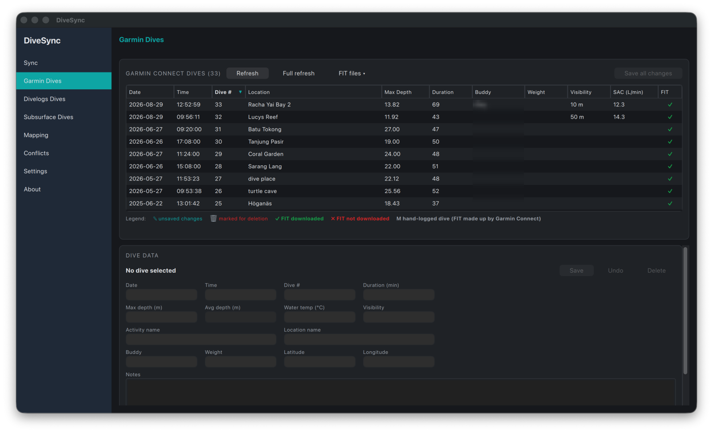
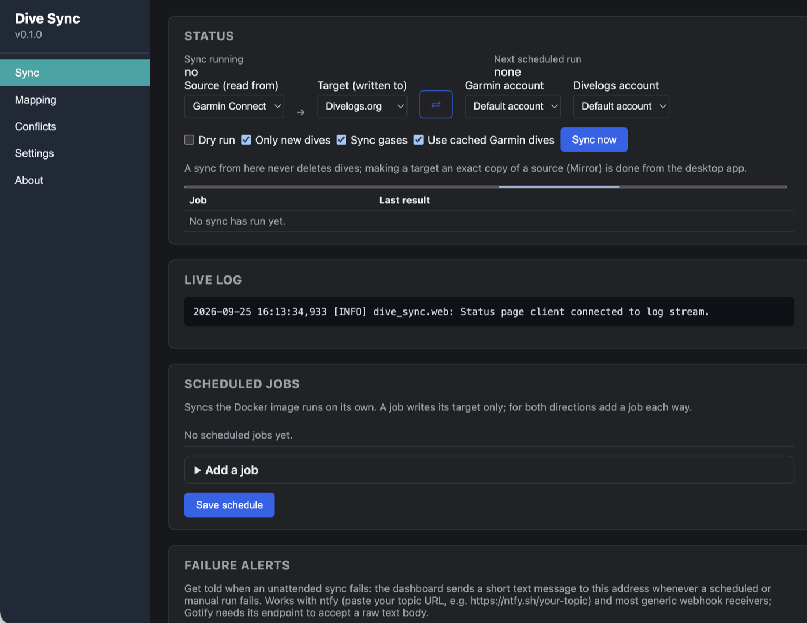
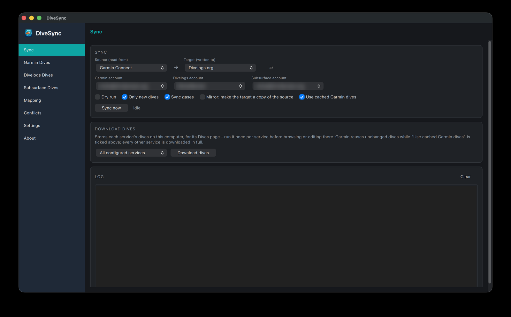
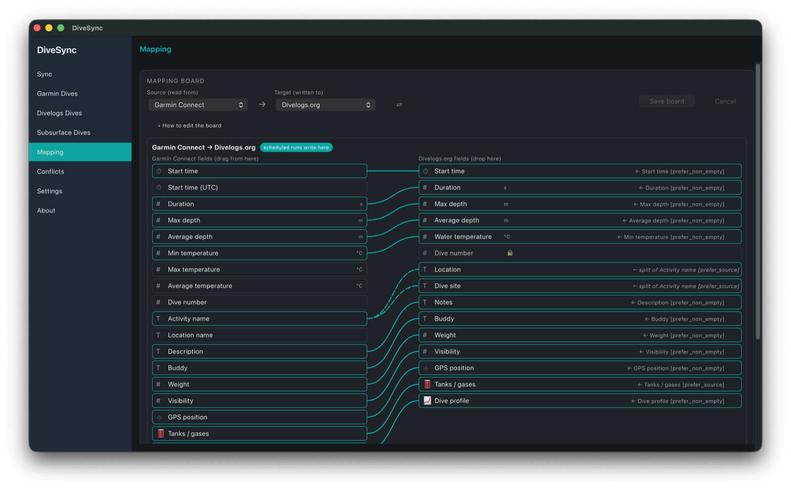
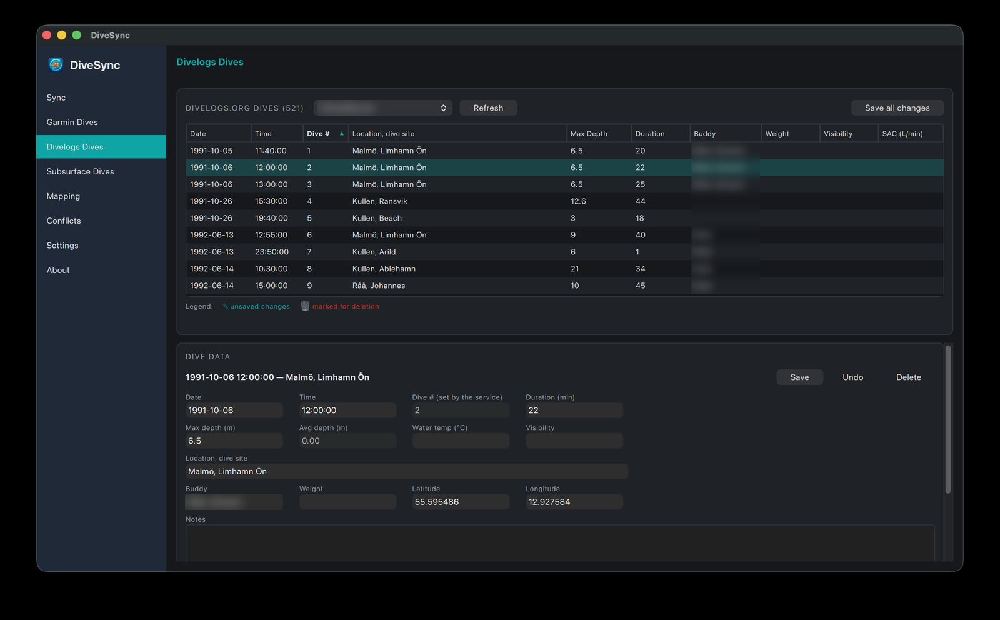
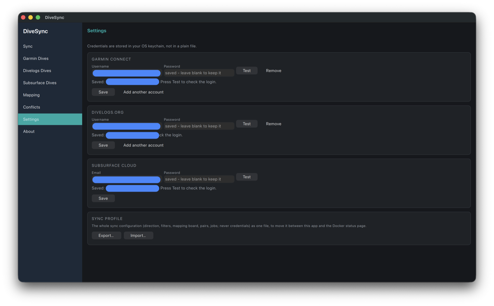
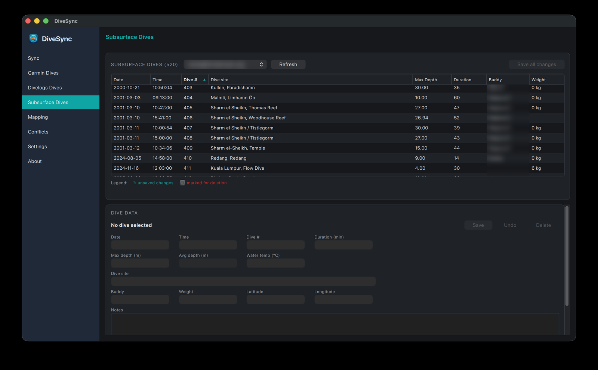
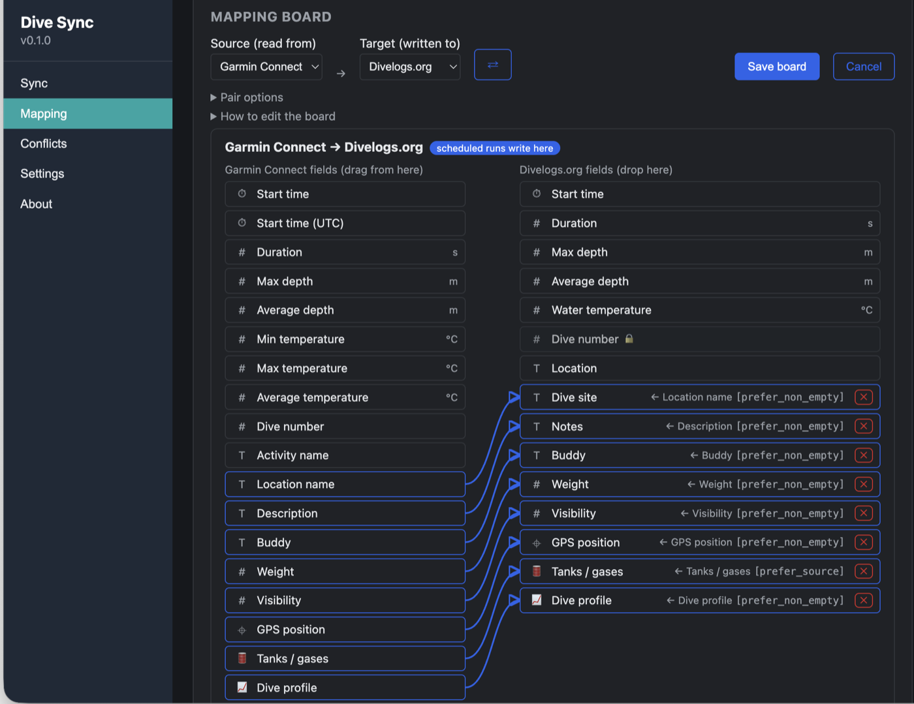
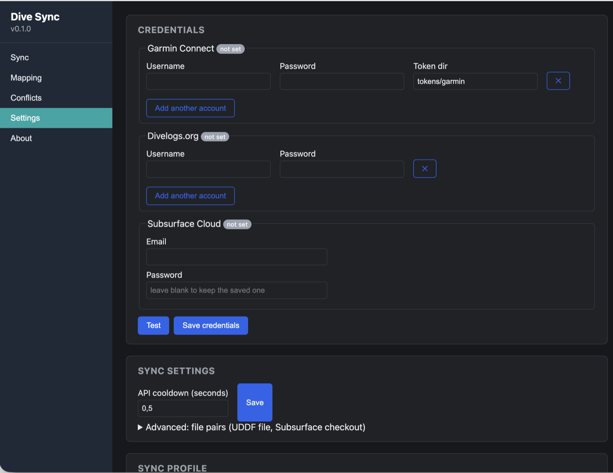

# Dive Sync 🤿✨ 

# Solution is still in Beta!!!!!
## I have mainly tested Garmin sync to Divelogs and not the other direction - be careful and keep a backup!

> **Note:** Submersion sync doesn't work as of now and is disabled: it isn't offered in the web dashboard, the desktop app, `setup_credentials.py` or the CLI.


Dive Sync is a dive log synchronization engine that matches and syncs your dive history between **Garmin Connect**, **Divelogs.org** and **Subsurface** (Subsurface Cloud, a Subsurface git checkout, or a UDDF file).

I started this project when i got back to diving and had to import all dives from logbooks to Garmin and to Divelogs.
I managed to make the import but the stability of the code wasn't good enough for release. Because of lack of time I didnt continue but with Gemini I saw the opportunity to finalize the project.

There are most likely a lot of bugs so please use it carefully, I will use the docker container myself and fix issues as I see them.

It features two-way syncing (one direction per run), detailed telemetry parsing (depth/temperature graphs and gas mixture sensors), and multi-account support.

It comes in two forms that share the same sync engine and settings format:
* **The desktop app** (DiveSync, PySide6/Qt Quick; macOS first, Windows and Linux builds in CI): run syncs by hand, browse and edit your dives on each service, edit the mapping board, resolve conflicts.
* **The Docker image**: an unattended, scheduled sync with a web dashboard (Sync now, scheduled jobs, live log, mapping board, conflicts, accounts). It syncs only; browsing and editing dives is the desktop app's job.

<p align="center">
  
  
</p>
<p align="center"><em>The desktop app (left) and the Docker image's web dashboard (right).</em></p>

<p align="left">
  <a href="https://skillicons.dev">
    
  </a>
</p>

---

## 🚀 Key Features

* **Two-Way Syncing, One Direction Per Run**: Every run reads a **source** and writes a **target** (to Divelogs, to Garmin, to Subsurface, ...). To keep two services in step both ways, run or schedule both directions — the second run sees what the first wrote, so nothing needs a tiebreak and no single run ever writes both sides.
* **Safe by default, Mirror on request**: a normal sync never deletes anything. The desktop app's **Mirror** option makes the target a copy of the source for one run (compares every dive, forces the mapped fields, deletes target dives the source doesn't have) — with a dry run to preview it.
* **Reliable matching**: dives are paired by stored links first, then by start time, and only then by match keys such as the dive number — so a renumbered log or a re-imported Garmin activity doesn't pair a dive with the wrong one.
* **Telemetry & Gas Mapping**: depth/temperature profiles, start/end tank pressures, gas mixtures (Nitrox/Trimix) and tank transmitter names (Garmin tank sensors).
* **Field-Level Mapping Board**: a drag-and-drop editor (desktop app and web dashboard) of what the target accepts from the source, field by field, with a policy per rule, composite templates, **splits** (e.g. Garmin's activity name "Gozo, Blue Hole" into Divelogs' location and dive site), and a queue for conflicts that need a manual pick.
* **Dive editing (desktop app)**: edit dives on Garmin Connect, Divelogs.org and Subsurface; changes are staged, shown in the list, and uploaded together with **Save all changes** (Garmin is slow — three requests per dive). Undo, staged deletes, Garmin FIT file downloads, and hand-logged Subsurface dives' duration and depths are editable too.
* **Scheduled Sync**: cron-like jobs (hourly/daily/weekly/custom interval, per-job pair, direction and filters) that run unattended in the Docker image, with optional failure alerts to a webhook (ntfy, Gotify, ...).
* **Multi-Account Support**: several Garmin and Divelogs accounts, selected per run from the CLI.
* **Docker Ready**: Package and run the scheduler with custom port routing and unified volume mapping to persist settings, credentials, session tokens, and data caches.

---

## 🛠️ Installation & Setup

### 1. Prerequisites
Ensure you have **Python 3.10+** installed. Clone the repository and install dependencies:
```bash
pip install -r requirements.txt
pip install -e .
```

### 2. Configure Credentials
Run the interactive setup tool to provision and verify your accounts:
```bash
python setup_credentials.py                      # all services, one section each
python setup_credentials.py --services garmin    # just one
```
Each section verifies the login read-only before saving and leaves the other sections untouched. Credentials go to `credentials.json` in `DATA_DIR` (the current directory when unset), so a second set of accounts for testing is simply a second directory:
```bash
DATA_DIR=~/.dive_sync_test python setup_credentials.py
DATA_DIR=~/.dive_sync_test python sync.py --dry-run
```
Supported services:
* **Garmin Connect** and **Divelogs.org**: username and password.
* **Subsurface Cloud**: the email and password from Subsurface's cloud storage preferences. Verified with one read-only request against the cloud git server.
* **Submersion**: disabled for now (see the note at the top); its settings are kept for when it works.

The desktop app asks for the same credentials on its **Settings** page and keeps them in the OS keychain instead of a file.

#### Single Account Structure (`credentials.json`):
```json
{
  "garmin": {
    "username": "user@domain.com",
    "password": "yourpassword"
  },
  "divelogs": {
    "username": "user_divelogs",
    "password": "yourpassword"
  },
  "subsurface": {
    "email": "you@example.com",
    "password": "yourpassword",
    "base_url": "https://cloud.subsurface-divelog.org/"
  }
}
```
The `subsurface` section is optional; an older file without it still loads. A Garmin account may also set `token_dir`, the folder for its login tokens; left out (the default), it is the account's own `garmin/<account>/tokens` folder.

#### Multiple Accounts Structure (`credentials.json`):
You can configure a list of credentials. Each account gets its own folder (e.g. `garmin/user1@domain.com/`, see [Where your data is kept](#where-your-data-is-kept)):
```json
{
  "garmin": [
    {
      "username": "user1@domain.com",
      "password": "pass1"
    },
    {
      "username": "user2@domain.com",
      "password": "pass2"
    }
  ],
  "divelogs": [
    {
      "username": "user1_divelogs",
      "password": "pass1"
    },
    {
      "username": "user2_divelogs",
      "password": "pass2"
    }
  ]
}
```

---

## 🖥️ Desktop App

```bash
python -m desktop          # from a source checkout
briefcase dev              # the same, through Briefcase
briefcase build macOS app && briefcase package macOS app    # a DiveSync.app / installer
```
Pre-built installers are attached to the GitHub releases (built by `.github/workflows/desktop-build.yml`). The app keeps its settings and caches in its own data folder (shown on the **About** page) and credentials in the OS keychain.

The pages:
* **Sync** — pick a **source** and a **target** (⇄ swaps them) and press **Sync now**. Options: *Dry run*, *Only new dives*, *Sync gases*, *Mirror* (make the target a copy of the source; asks for confirmation) and *Use cached Garmin dives*. With several accounts for a service, pick which one to sync with next to the source and target (remembered). **Download dives** stores each service's dives on this computer for its Dives page (only the picked accounts); the run log is below.
* **Garmin Dives / Divelogs Dives / Subsurface Dives** — every dive of that service in a sortable table (pick columns with a right-click on the header). Select a dive to edit it; edits are staged (✎) and shown in the table, deletions are staged too (🗑), **Undo** drops them, and **Save all changes** uploads them in one go (on Divelogs and Subsurface, **Save** uploads a single dive right away). On Garmin: separate *Activity name* and *Location name*, a **FIT files** menu to download the original `.fit` files (✓ downloaded, ✗ not yet, M hand-logged), and **Full refresh** that re-fetches every dive and its FIT file. On Subsurface, duration and depths come from the dive profile, so they are editable on hand-logged dives only. With several accounts, each page has its own account picker next to **Refresh** (remembered, independent of the Sync page); every account's dives are kept in their own folder.
* **Mapping** — the mapping board for a source → target (see below); pair options (scheduled direction, grace window, propagate deletes, create on Garmin) are on their own card.
* **Conflicts** — every pair's queued conflicts, with the two values side by side and **Keep this** per side. The app keeps each pair's sync history (links, last sync time, conflicts) per account combination, so a test account never mixes with a live one; boards are shared by all accounts.
* **Settings** — any number of accounts for Garmin Connect, Divelogs.org and Subsurface Cloud (with a login test), and export/import of the whole sync configuration as a profile.
* **About** — version, update check, license, data folder.

<table>
  <tr>
    <td><br><sub><b>Sync</b>: source → target, options, Download dives and the run log</sub></td>
    <td><br><sub><b>Mapping</b>: what the target takes from the source, with a split (dashed)</sub></td>
  </tr>
  <tr>
    <td><br><sub><b>Garmin Dives</b>: FIT status per dive, staged edits, Save all changes</sub></td>
    <td><br><sub><b>Divelogs Dives</b>: the same editor for Divelogs.org</sub></td>
  </tr>
  <tr>
    <td><br><sub><b>Settings</b>: accounts (kept in the OS keychain) and the sync profile</sub></td>
    <td><br><sub><b>Subsurface Dives</b>: the same editor for Subsurface Cloud, with its own account picker</sub></td>
  </tr>
</table>

---

## 💻 CLI Usage

The synchronization command-line interface is accessed via `sync.py`.

```bash
# Run a dry-run sync (simulate transfers without modifying remote data)
python sync.py --dry-run

# Run the sync in the saved direction (settings.json: "directionality", e.g. to_divelogs)
python sync.py

# Sync the other way in a second run - a run only ever writes one side
python sync.py --direction to_garmin

# Download all raw history JSONs into local data caches (defaults to `./data`)
python sync.py --save-raw-data

# Execute sync targeting a specific user pair (for multi-account configurations)
python sync.py --garmin user1@domain.com --divelogs user1_divelogs

# Back up your entire synced history to flat local JSON files
python sync.py --backup --garmin-path my_garmin.json --divelogs-path my_divelogs.json
```

### Options Overview:
* `--date-from YYYY-MM-DD`: Sync only dives occurring on or after this date.
* `--date-to YYYY-MM-DD`: Sync only dives occurring on or before this date.
* `--full-sync`: Force a full sync instead of an incremental check.
* `--no-garmin-cache`: Fetch every Garmin dive from Garmin Connect. By default a sync reads a Garmin dive from the local refresh cache when Garmin's activity list shows it unchanged (and caches what it does fetch); that list does not reveal an edit to only notes, buddy, weight or visibility, which is what this flag is for.
* `--direction`: Which side this run writes: `to_garmin`, `to_divelogs`, `to_<service>`, `to_target` or `to_source`. Without it the pair's saved direction is used. `bidirectional` is no longer accepted — run each direction separately. **Deletes follow the direction**: with *propagate deletes* on, a dive gone from the sending side is deleted on the receiving side; a dive gone from the receiving side is left alone by that run (the opposite run removes it from the sender). A sync started from the desktop app's Sync page never deletes unless *Mirror* is ticked.
* `--overwrite`: With `--save-raw-data`, fetch every Garmin dive again instead of reusing the unchanged ones (other services are always downloaded in full).

### Other services: UDDF files and Subsurface

Besides Garmin and Divelogs, a sync can target a UDDF 3.2 file (which both Subsurface and Submersion import and export) or a Subsurface git-storage directory (what Subsurface Cloud and Subsurface's git repositories contain). Name the two sides with `--source` and `--target`, or configure a pair once in `settings.json` and run it by id:

```bash
python sync.py --source garmin --target uddf:garmin_export.uddf --full-sync     # file under DATA_DIR
python sync.py --source divelogs --target subsurface:/path/to/subsurface-checkout
python sync.py --pair to-subsurface                                             # a pair from sync_pairs
```

```json
"sync_pairs": [
  {"id": "to-subsurface", "source": "garmin", "target": "subsurface:subsurface-repo", "directionality": "to_subsurface"}
]
```

Each pair has its own direction, grace window and mapping board (defaults are generated per pair). The Garmin ↔ Divelogs pair is itself an entry in `sync_pairs`, always the first one, with the fixed id `garmin_divelogs` — `python sync.py` with no `--pair`, the Docker default job and the boards' first entry all mean that pair. Settings files written before this (a top-level `directionality` / `field_links`) are upgraded on first load; the file then says `"settings_version": 2`.

**Subsurface Cloud** needs no checkout of your own: with the account configured by `setup_credentials.py --services subsurface`, the spec `subsurface-cloud` clones the repository under `DATA_DIR/subsurface/<account>/cloud/`, refreshes it from the cloud at the start of every run, and commits and pushes once at the end. It never force-pushes; if Subsurface pushed in between, the run's changes are replayed on top of the new state.

```bash
python sync.py --source garmin --target subsurface-cloud --full-sync
```

**Submersion** is disabled for now (see the note at the top).


### Mapping, conflicts and profiles

Which field feeds which, in what direction, and who wins a conflict is defined by the *mapping board* — see the "🗺️ Mapping Board" section below for what that actually means. Edit it visually in the desktop app or on the web dashboard, or from the CLI:

```bash
# Show the board as a table (and any problems with it)
python sync.py --show-mapping

# Rehearse the board read-only against the newest 10 dives per side
python sync.py --test-mapping

# Links with conflict policy "manual" queue conflicts instead of overwriting
python sync.py --list-conflicts
python sync.py --resolve <conflict-id> source     # or: target

# Move the whole sync configuration (never credentials) between machines
python sync.py --export-profile dive_sync_profile.json
python sync.py --validate-profile dive_sync_profile.json
python sync.py --import-profile dive_sync_profile.json     # shows a summary, asks before applying (--yes skips)
```

---

## 🗺️ Mapping Board (fields, rules, templates and conflicts)

Every synced field is controlled by the *mapping board*, identical whether you edit it in the desktop app, on the web dashboard, or by hand in `settings.json`. There's one board per pair of services — the Garmin ↔ Divelogs pair (`garmin_divelogs`), one for every pair you add (a UDDF file, a Subsurface checkout, ...), and one for each combination of the services you have accounts for (e.g. Garmin ↔ Subsurface Cloud), which starts from the shipped defaults and is saved into `sync_pairs` the first time you save it. A board is two lists of **rules**, one per receiving side: *what Divelogs takes from Garmin* and *what Garmin takes from Divelogs*. A sync run writes exactly one side, and applies that side's list.

**Field catalogue.** Each service publishes what it can read and write (`GET /api/fields`) — a read-only field (e.g. Divelogs numbers its own dives) can never be written by a rule; the board UIs show these as locked.

**A rule** says what one field of the receiving side *accepts*: `receiver field ← sender field(s) [+ template], policy`. It has:
- **A policy**, read from the receiver's side — what happens when the sender's value differs from mine:
  - `manual` *(the default for most fields)* — a blank field is filled for free; a genuine disagreement is queued in the **Conflicts** view for you to pick a winner. Nothing is ever silently overwritten.
  - `prefer_non_empty` — the same "fill me when blank, never overwrite a real value" behaviour as `manual`, except a real disagreement is just logged, not queued. Used for `samples` (a depth/temperature profile "conflict" is hundreds of points — nothing to usefully arbitrate one at a time).
  - `prefer_source` — take the sender's value whenever it has one, even over a different value already here — but an *empty* sender never blanks a field that already has data. Used for `tanks`, so the dive computer stays the source of truth for gas data even after the other side has stale readings.
  - `source_wins` — always take the sender's value, blank or not. Available if you want stricter behaviour than `manual`.
  - `target_wins` — "never overwrite me": the receiving side owns this field and the rule is a deliberate no-op (new dives are not filled from it either). Useful to state the intent on the board rather than leave the field without a rule.
- **A template** (composite rules), optionally with a **reverse pattern** — see below.
- Fields without a rule are not synced. A field that syncs both ways is simply the same rule on both receivers.

**Templates (composite rules).** A rule's field can be rendered from a small text template combining several of the sender's fields instead of copying one field verbatim. The shipped `activity_name` rule is the example: Garmin's activity title is built from Divelogs' region and dive site —
```
template: "{divelogs.location}, {divelogs.divesite}"
```
so a Divelogs dive with location `Larnaca` and dive site `Zenobia` uploads to Garmin titled `Larnaca, Zenobia`. In either board UI, you build one by dropping a *second* field onto a field that already has a rule; the editor shows a live preview as you edit the template.

**Splits (a composite taken apart).** A composite rule can also work backwards: on a run *towards the sources' side* its field is split back into the fields it is built from. With the template `{divelogs.location}, {divelogs.divesite}`, Garmin's activity name "Gozo, Blue Hole" becomes Divelogs location "Gozo" and dive site "Blue Hole" — on matched dives and on newly uploaded ones. The value is cut at the text between the fields in the template (spacing around it doesn't matter; the first occurrence wins); a value without that text is left alone rather than guessed at. The easiest way to make one: in the source → target panel, drag the same text field onto two fields of the target, and the board offers to split it. In the rule editor it is the **"Split … back into …"** checkbox with its own policy; a custom regex with named groups is still possible under *Custom split pattern*. In `settings.json` a split is `"reverse": "auto"` (or the regex) with `"reverse_conflict"` as its policy. Only text fields can be split.

**Matching.** Dives are paired in passes: first the links remembered from earlier runs (and the ids Subsurface stores on its dives), then **start times** within the grace window (closest first), and only then the pair's ordered `match_keys` — a field both sides carry, such as the dive number — for dives whose clocks disagree (a time-zone shift), within a day of each other. Start time comes first on purpose: a number can go stale when a log is renumbered, a start time doesn't.

**Shipped defaults (Garmin ↔ Divelogs).** Buddy, notes, weight, visibility, GPS, and site name are accepted on both sides with `manual`; tanks and depth/temperature profiles are accepted by Divelogs only (Garmin's gas API can't be written, and can't record samples at all); Garmin's activity title is built from Divelogs' location/dive site for new dives (see the template above). A pair beyond Garmin ↔ Divelogs starts from a smaller, generic default board covering the fields both sides actually have; where both services let you set the dive number (e.g. Garmin → Subsurface), the number is a match key and follows the source. If you want the old pre-board behaviour (Garmin always wins every difference), that board is still available as `fields.legacy_field_links()`.

**The conflict queue.** Any `manual`-policy rule where both sides hold a value and they differ gets recorded (`conflicts.json`) instead of being resolved automatically. Resolve one from the desktop app's **Conflicts** page (all pairs; **Keep this** on the value to keep, the other side gets updated) or the web dashboard's Mapping page, or from the CLI (`--list-conflicts`, `--resolve <id> source|target`). An unresolved conflict is re-evaluated — and re-queued if it's still unresolved — on the next run that revisits that dive.

**Editing the board.** Visually: pick a **source** and a **target** (⇄ shows the other direction) and the board shows what the target takes from the source — the source's fields on the left, the target's on the right. Drag a field from the left onto a field on the right (or click one, then the other) to add a rule; drop a second field onto a rule to make a composite; drag the same text field onto a second field to split it (shown as "⇠ split of …"). Click a rule to change its policy (and, where it applies, its template or split). **Save board** asks whether to re-apply the changed mapping to every already-matched dive on the next run. The pair's own options — the direction scheduled runs write, grace window, propagate deletes, create on Garmin — sit apart from the board. By hand: `sync_pairs[].rules` in `settings.json` (see below), or `POST /api/settings` — the API also still accepts a version-1 board as `field_links` (top level for the `garmin_divelogs` pair, or on a pair) and stores it as rules.

**How a board is stored (`settings_version` 2).** Under the receiver's id in the pair's `rules`, plus the pair's `match_keys`:
```json
"sync_pairs": [{
  "id": "garmin_divelogs", "source": "garmin", "target": "divelogs", "directionality": "to_divelogs",
  "rules": {
    "divelogs": [{"id": "buddy", "target": "divelogs.buddy", "source": ["garmin.buddy"], "conflict": "manual"}],
    "garmin":   [{"id": "buddy", "target": "garmin.buddy",   "source": ["divelogs.buddy"], "conflict": "manual"},
                 {"id": "activity_name", "target": "garmin.activityName",
                  "source": ["divelogs.location", "divelogs.divesite"], "conflict": "manual",
                  "template": "{divelogs.location}, {divelogs.divesite}"}]
  },
  "match_keys": []
}]
```
`python sync.py --show-mapping` prints a board as "what X takes from Y" per side, and `--test-mapping` names the receiver on every row. Settings files and sync profiles written before version 2 (a top-level `field_links` list with a direction per link) are upgraded on load; a profile exported by this version is version 2 and older builds refuse it.

---

## 🐳 Docker Deployment

The application is fully containerized. You can run the web dashboard server in background mode, mount a local volume for configurations/session persistence, and select a port:

### 1. Pull Pre-built Image from Docker Hub
```bash
docker pull mickemannen/dive_sync:latest
```

### 2. Run the Container
Map a local host directory (for config, caches, and token persistence) and route the dashboard to your chosen port (e.g. `8080`):
```bash
docker run -d \
  --name dive_sync \
  -p 8080:8000 \
  -v /absolute/path/to/local/dir:/app/data \
  -e TZ=Europe/Stockholm \
  mickemannen/dive_sync:latest
```

The container exposes:
- **Web dashboard**: available at `http://localhost:8080` — sync status, live log, mapping board, accounts and schedule (see "🌐 Web Dashboard" below)
- **Volume Mount**: `/app/data/` (contains `settings.json`, `credentials.json`, `sync/`, `backups/` and one folder per service - see [Where your data is kept](#where-your-data-is-kept))

#### Or with Docker Compose
Save this as `docker-compose.yml`; `./data` next to it becomes the data folder:
```yaml
services:
  dive_sync:
    image: mickemannen/dive_sync:latest
    container_name: dive_sync
    ports:
      - "127.0.0.1:8080:8000"   # localhost only - the dashboard has no login
    volumes:
      - ./data:/app/data
    environment:
      - DIVE_SYNC_PORT=8000
      - DIVE_SYNC_HOST=0.0.0.0
      - TZ=Europe/Stockholm     # your time zone; scheduled jobs run on this clock
    restart: unless-stopped
```
```bash
docker compose up -d          # start (and after editing the file)
docker compose pull && docker compose up -d   # update to the newest image
docker compose logs -f        # follow the log
```

| Variable | Default | Description |
| --- | --- | --- |
| `DIVE_SYNC_PORT` | `8000` | Port of the dashboard inside the container |
| `DIVE_SYNC_HOST` | `0.0.0.0` | Bind address inside the container |
| `DATA_DIR` | `/app/data` | Settings, credentials, tokens and caches |
| `TZ` | UTC | Time zone of the container's clock, e.g. `Europe/Stockholm` |

**Time zone.** Scheduled jobs run on the container's clock, and a container runs on UTC unless `TZ` is set: without it, a job set to 06:00 runs at 06:00 UTC (08:00 in Swedish summer time). Set `TZ` to your [time zone name](https://en.wikipedia.org/wiki/List_of_tz_database_time_zones) and check it with `docker exec dive_sync date`, which should print your local time.

To reach the dashboard from other machines, drop the `127.0.0.1:` prefix only on a private network or behind a VPN or an authenticating reverse proxy (see "🔒 Security").

### 3. Building a release (GitHub Actions)
Nothing is built or published automatically. To release:
1. Create a GitHub Release with a `vX.Y.Z` tag, e.g. `v0.1.0` (draft or published). The tag is the version: the build writes it into `pyproject.toml` on the runner (the desktop app shows it on its About page), so there is nothing to bump by hand. Plain numbers only — Windows installers reject tags like `v0.1.0-beta`.
2. In the **Actions** tab, run **Build and attach release artifacts** (`.github/workflows/release-build.yml`): pick the release's tag in the **Use workflow from** dropdown (a branch is refused) and tick the platforms to build: macOS (signed and notarized), Windows and Linux installers are attached to the release.
3. Tick **push_docker** there (or run `.github/workflows/docker-release.yml` on its own) to build the multi-architecture image (`linux/amd64`, `linux/arm64`) and push it to Docker Hub; the tag is baked in as `APP_VERSION`, which the web dashboard's About page shows.

`.github/workflows/desktop-build.yml` builds the desktop app for a quick check (ad-hoc signed) without a release.

#### Required GitHub Secrets:
Set the following secrets in your GitHub repository (**Settings ➔ Secrets and variables ➔ Actions**):
- `DOCKERHUB_USERNAME`: Your Docker Hub username (`mickemannen`)
- `DOCKERHUB_TOKEN`: A Personal Access Token (PAT) generated in Docker Hub (**Account Settings ➔ Security ➔ Personal access tokens**)

#### Updating the Docker Hub Overview Page:
The GitHub workflow automatically syncs [`DOCKERHUB.md`](DOCKERHUB.md) to your Docker Hub repository description overview page (`hub.docker.com/r/mickemannen/dive_sync`) every time it pushes an image.

---

## 🌐 Web Dashboard

Start the web dashboard locally without Docker:
```bash
python docker_run.py
```
Open `http://localhost:8000` in your web browser. It is the unattended side of the project: it syncs, it does not browse or edit dives (that is the desktop app). The pages:
1. **Sync**: whether a sync is running, the next scheduled run, and **Sync now** for a source → target (dry run, only new dives, sync gases, use cached Garmin dives) with its progress and the live log; **Scheduled jobs** as a list ("Garmin Connect → Divelogs.org, every day at 06:00") with **Add job** asking what and when; and **Failure alerts**: a webhook (e.g. an ntfy topic) that gets a short message whenever a run fails. A sync from here never deletes dives — Mirror is desktop-only.
2. **Mapping**: the mapping board for a source → target and the pair's options — see the "🗺️ Mapping Board" section above.
3. **Conflicts**: every pair's queued conflicts with **Keep this** per side.
4. **Settings**: Garmin, Divelogs.org and Subsurface Cloud credentials (with a test), the API cooldown, file pairs (UDDF file, Subsurface checkout) under *Advanced*, and the sync profile export/import.
5. **About**: version (the Docker image's `APP_VERSION`), update check and license.

<table>
  <tr>
    <td><br><sub><b>Sync</b>: Sync now, the live log and scheduled jobs</sub></td>
    <td><br><sub><b>Mapping</b>: the same board as the desktop app</sub></td>
    <td><br><sub><b>Settings</b>: accounts, API cooldown, file pairs, profile</sub></td>
  </tr>
</table>

---

## 📂 Where your data is kept

| Runs as | Data folder |
| --- | --- |
| Desktop app, macOS | `~/Library/Application Support/org.christersson.dive_sync` |
| Desktop app, Windows | `%LOCALAPPDATA%\Christersson\DiveSync` |
| Desktop app, Linux | `~/.local/share/dive-sync` |
| Docker | the volume mounted at `/app/data` (`DATA_DIR`) |
| CLI | `DATA_DIR`; unset, settings in the working directory and caches in `./data` |

Inside it, everything one account owns sits in one folder:

```
settings.json, credentials.json    settings (the desktop app keeps passwords in the OS keychain)
sync/                              remembered dive pairs, conflicts, run history
backups/                           a snapshot of both sides before each sync run
garmin/<account>/data/             cached Garmin dives
garmin/<account>/fit/              downloaded .fit files
garmin/<account>/tokens/           Garmin login tokens
divelogs/<account>/data/           cached Divelogs dives
subsurface/<account>/data/         cached Subsurface dives
subsurface/<account>/cloud/        the Subsurface Cloud checkout
```

A side without accounts (a Submersion store, a local Subsurface folder) uses the account folder `default`. Version 0.3.0 changed this layout and the desktop app's folder: it starts fresh and leaves an earlier version's data where it was (see `CHANGELOG.md`).

## 🗄️ Garmin Dive Cache

Garmin Connect is slow: each dive takes three API calls, with a cooldown between calls. **Use cached Garmin dives** (on by default; desktop app, web dashboard, scheduled jobs; `--no-garmin-cache` turns it off on the CLI) makes a sync skip dives it already has. The cache is refreshed as part of every sync, not in a separate step:

1. The sync fetches Garmin's activity list, a few calls in total.
2. It compares each dive in the list with the copy in the cache: name, location, dive number, duration, depths, temperature, times and a few more fields.
   - **Unchanged**: the cached copy is used, with no further calls to Garmin.
   - **New or changed**: the full dive is fetched (three calls) and the cache is updated.

New dives and most edits are always picked up. **The catch:** the activity list doesn't include notes, buddies, weight or visibility, so an edit to *only* those fields on Garmin leaves the dive looking unchanged, and the old cached copy is used. Such an edit is picked up by a sync with the option off, or by a **Full refresh** on the desktop app's Garmin dives page.

For scheduled jobs, a good setup is a frequent job with the cache on, plus a weekly job with it off to catch those edits. The cache lives in `garmin/<account>/data/` in the data folder.

## 🧪 Testing

Run all unit, mock, and API tests to verify execution logic:
```bash
./run_tests.sh
```

---

## ⚠️ Limitations

- **Beta quality.** Garmin → Divelogs and Garmin → Subsurface are the exercised paths; Divelogs → Garmin and Subsurface → Garmin much less so. Keep backups (`--backup`, and Subsurface Cloud keeps its git history).
- **Gases and tanks never reach Garmin Connect.** Garmin's activity API accepts no gas or tank data, on creation or update; gases on Garmin come only from the dive computer and from tank sensors assigned in the Garmin Connect mobile app. Dives uploaded to Garmin therefore arrive without tanks. Reading works: once a second transmitter is assigned to a dive in the mobile app, both tanks are visible to dive_sync. Details of the investigation: [docs/garmin_diving_api.md](docs/garmin_diving_api.md).
- **Divelogs numbers dives itself** from date and time, so dive numbers are never synced or matched on that pair.
- **Profiles and tanks flow one way to Divelogs** (Garmin cannot take them back). Divelogs stores profiles at a fixed sample rate; irregular Garmin profiles are resampled on the way.
- **Two runners, one account.** Docker (scheduled) and the desktop app (manual) may sync the same accounts from different machines. There is no shared lock and each keeps its own sync state, conflicts and Garmin token cache; both honour `api_cooldown_seconds`, but back-to-back runs from two machines can still hit Garmin's login rate limit (HTTP 429, wait 10–15 minutes). Let one runner finish before starting the other.
- **Pairs are remembered locally.** Garmin and Divelogs cannot store each other's id, so the matched pairs live in `sync/sync_state.json` next to your settings. Deleting that file makes the next run re-match by time (fine) and forget which dives it uploaded (uploads are not repeated because they now match by time, unless the times were shifted).
- **Multi-account** works only from the CLI (`--garmin`, `--divelogs`); the scheduler, web dashboard and desktop app assume one account per service.
- **Subsurface keeps a recorded dive's profile as recorded.** Its duration and depths follow from the dive computer's profile and are only written on hand-logged dives; Subsurface has no visibility in metres (only a 0–5 rating), so visibility is not synced there.
- **A water temperature of 0 °C counts as "not recorded".** Garmin stores 0 on a hand-logged dive whose temperature was never entered; a genuine 0 °C dive would be treated the same.
- **Mirror deletes for real.** Mirroring to Garmin removes device dives that cannot be restored from here (the automatic pre-sync backup keeps the dive data, not the original file). Run it as a dry run first, and download the FIT files beforehand if you want them.
- **Submersion sync is disabled** until it works reliably.

---

## 🔒 Security

The web dashboard has **no authentication**. Anyone who can reach its port can read the log, change the schedule and save credentials. Run it on a private network only, or behind something that authenticates for it: a reverse proxy with a login (Caddy, nginx, Authelia), a VPN, or Tailscale. Note that the default `DIVE_SYNC_HOST=0.0.0.0` binds every interface of the host; use `127.0.0.1` when a proxy on the same machine fronts it.

`credentials.json` holds passwords in clear text, and the Garmin token cache under `garmin/<account>/tokens/` grants API access without the password. Keep `DATA_DIR` private (mode 700) and out of version control. The desktop app keeps credentials in the OS keychain instead and writes them to disk only for the duration of an operation.

---

## 📄 License
MIT, see [LICENSE](LICENSE). The desktop app uses PySide6 (Qt for Python), which is LGPL and linked dynamically; that is compatible with the MIT licence of this project. Garmin Connect, Divelogs.org and Subsurface are the names of their owners' services; this is an independent project, not affiliated with them.
